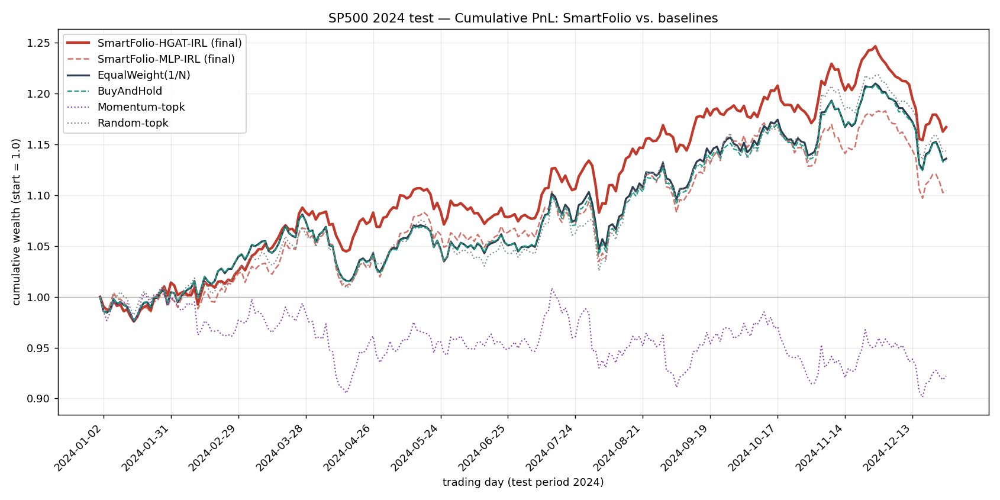

# SmartFolio — SP500 Results

Heuristic-guided IRL portfolio optimization (IJCAI-25 #1054), reproduced and evaluated on the S&P 500 test period (2024).

## Setup

- Market: **S&P 500** (472 constituents that survive the all-dates filter), train 2018–2022 / val 2023 / **test 2024**.
- Training config (paper §4.1): lr 1e-4, batch 128 (HGAT 32 — memory), 128-d hidden, 8 heads, 200 epochs, seed 0.
- Policies: **HGAT** (paper full model) and **MLP** (paper's *w/o HGAT* ablation).
- Baselines: non-learning strategies on the identical test set.

## Metrics (S&P 500, 2024 test)

ARR = annualised return, AVol = annualised volatility, SR = Sharpe, MDD = max drawdown, CR = Calmar, IR = information ratio (vs. equal-weight market).

| Strategy | ARR | AVol | SR | MDD | CR | IR |
|---|---|---|---|---|---|---|
| SmartFolio-HGAT-IRL (final) | 0.1743 | 0.1063 | 1.5116 | -0.0741 | 2.3540 | 0.5750 |
| SmartFolio-HGAT-IRL (best-val) | 0.1117 | 0.1327 | 0.7979 | -0.0681 | 1.6410 | -0.6836 |
| SmartFolio-MLP-IRL (final) | 0.1134 | 0.1216 | 0.8836 | -0.0727 | 1.5600 | -0.7153 |
| SmartFolio-MLP-IRL (best-val) | 0.1353 | 0.1100 | 1.1546 | -0.0807 | 1.6769 | -0.2141 |
| EqualWeight(1/N) | 0.1443 | 0.1164 | 1.1583 | -0.0700 | 2.0618 | 0.0000 |
| BuyAndHold | 0.1417 | 0.1156 | 1.1472 | -0.0700 | 2.0247 | -0.2451 |
| Momentum-topk | -0.0671 | 0.1544 | -0.4498 | -0.1067 | -0.6289 | -2.3521 |
| Random-topk | 0.1531 | 0.1245 | 1.1447 | -0.0684 | 2.2380 | 0.1926 |

Paper reference (Table 1, S&P 500, *Ours*): ARR 0.250, AVol 0.117, SR 1.906, MDD −0.058, CR 4.293, IR 1.184.

## Cumulative PnL

Final cumulative wealth (start = 1.0):

- SmartFolio-HGAT-IRL (final): **1.1670**
- SmartFolio-HGAT-IRL (best-val): **1.1015**
- SmartFolio-MLP-IRL (final): **1.1047**
- SmartFolio-MLP-IRL (best-val): **1.1280**
- EqualWeight(1/N): **1.1360**
- BuyAndHold: **1.1336**
- Momentum-topk: **0.9222**
- Random-topk: **1.1436**

## Did it learn anything?

The PPO test metric varied a lot from epoch to epoch (typical for RL on a portfolio task) so two checkpoints are reported: **final-epoch** (paper convention) and **best-val** (the validation-Sharpe-maximising checkpoint, fairer for noisy training).

- **SmartFolio-HGAT-IRL (final)** (SR +1.512) beats 1/N (SR +1.158); beats random (SR +1.145).
- **SmartFolio-HGAT-IRL (best-val)** (SR +0.798) matches/loses to 1/N (SR +1.158); matches/loses to random (SR +1.145).
- **SmartFolio-MLP-IRL (final)** (SR +0.884) matches/loses to 1/N (SR +1.158); matches/loses to random (SR +1.145).
- **SmartFolio-MLP-IRL (best-val)** (SR +1.155) matches/loses to 1/N (SR +1.158); beats random (SR +1.145).
